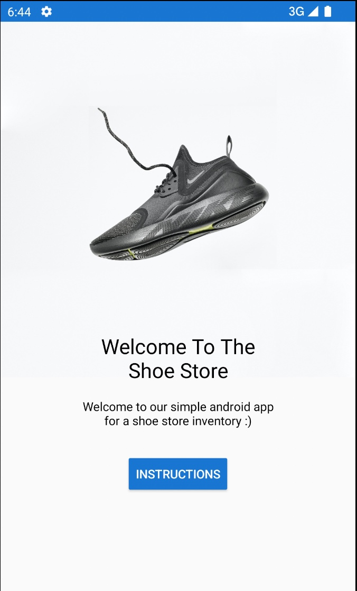
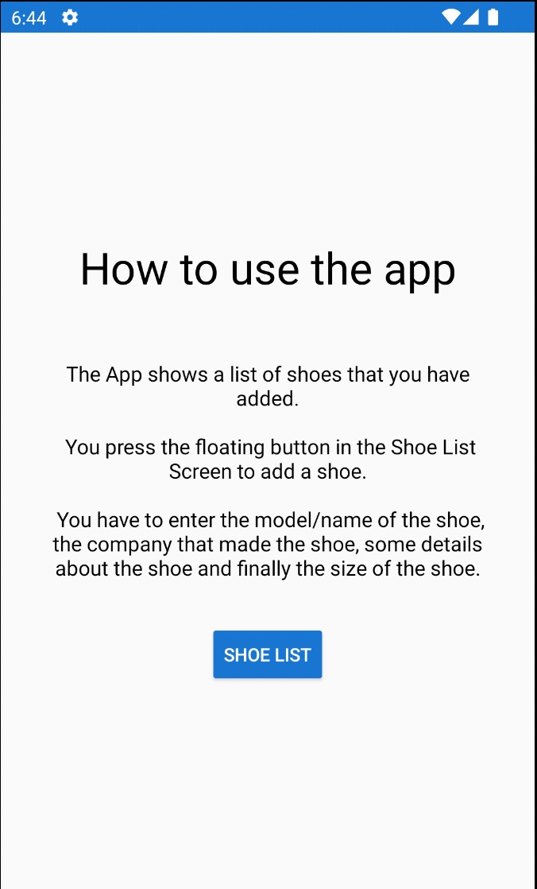
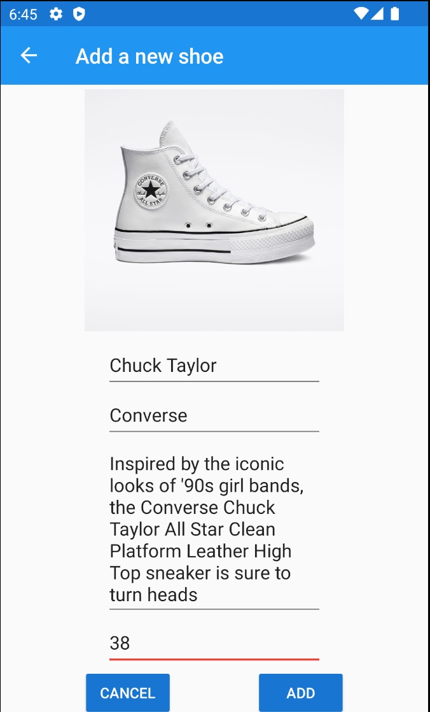
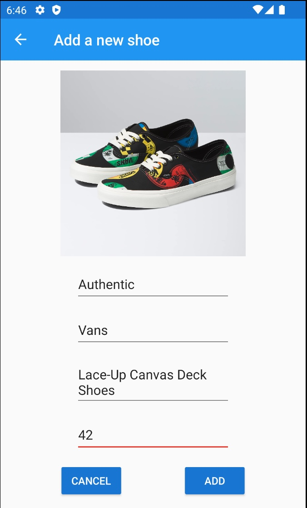
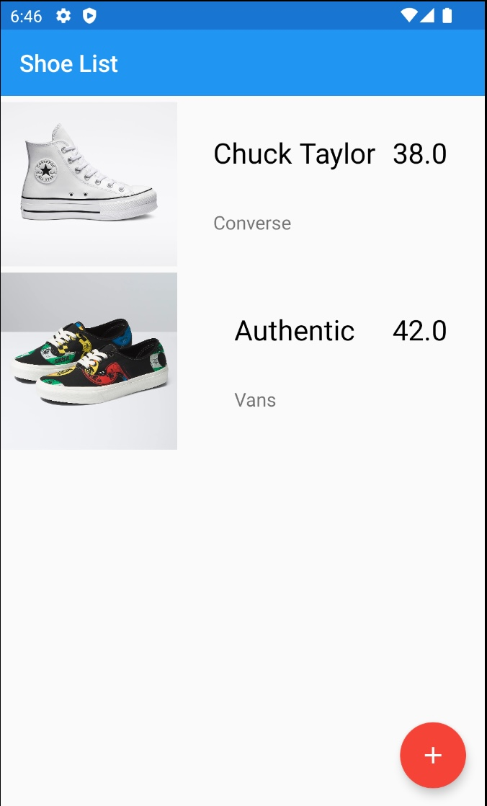

# Shoe Store Inventory App

A simple Shoe store app that you can add the shoes you have in your inventory from a few selected models.

## Getting Started

Pull the repo to your local machine and open the folder as a project using Android Studio

### Dependencies

```
val nav_version = "2.5.1"

Project:
apply plugin: "kotlin-parcelize"

classpath "androidx.navigation:navigation-safe-args-gradle-plugin:$nav_version"

Module:
dependencies {
    implementation "androidx.navigation:navigation-fragment-ktx:$nav_version"
    implementation "androidx.navigation:navigation-ui-ktx:$nav_version"
    implementation "androidx.navigation:navigation-dynamic-features-fragment:$nav_version"
    androidTestImplementation "androidx.navigation:navigation-testing:$nav_version"

    implementation 'com.jakewharton.timber:timber:5.0.1'
}

buildFeatures {
    dataBinding true
}
```

## Program Flow


## Screenshots







